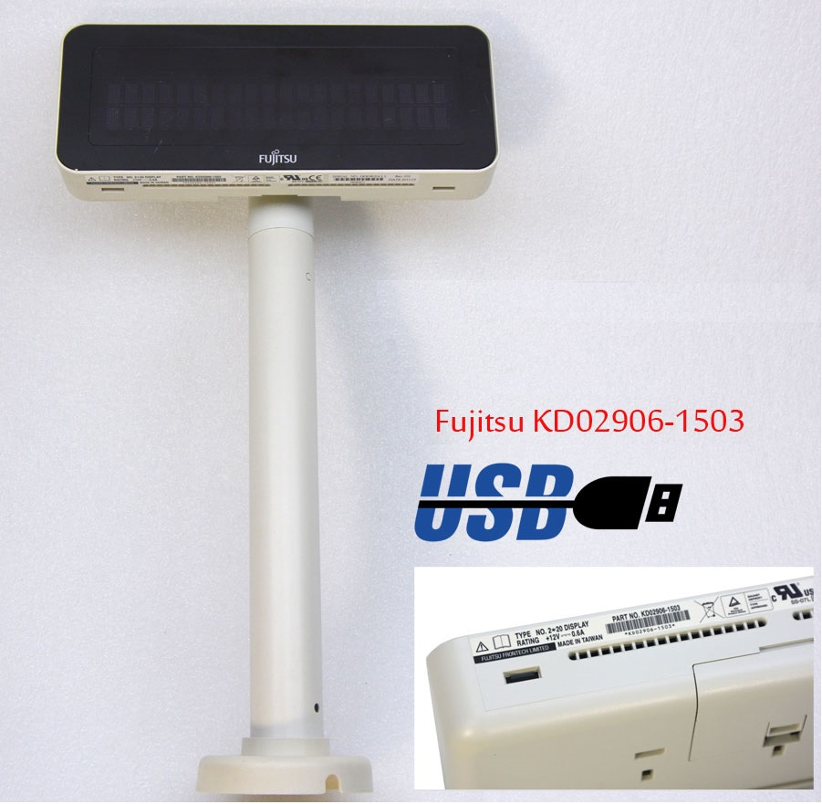
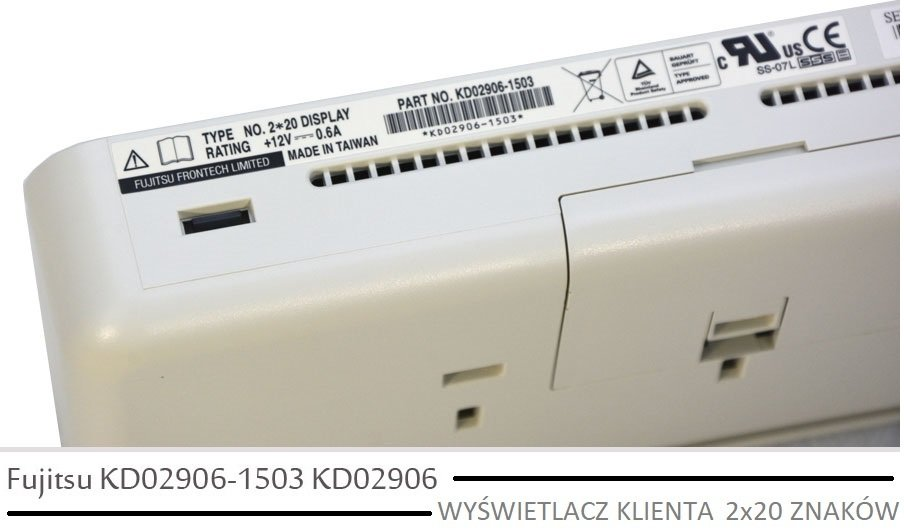
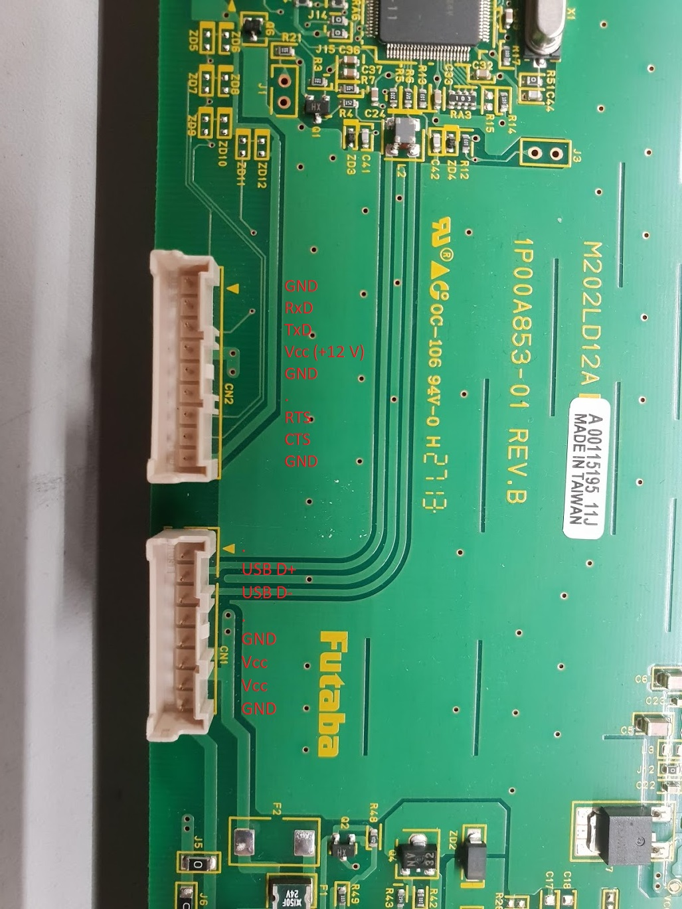

# Fujitsu VF60 hacking

This kind of VFD display:

# Pinout

Display can be used by USB and RS-232.

In USB mode, it requires custom 32-bit drivers (which eventually creates COM port).
RS-232 is much easier, described below.

Original docs: http://www.fujitsu.com/us/support/solutions/industry/retail/peripheral-drivers/

# Protocol

9600N1

Basic usage:
 - to display something, just send it
 - `\n` to go to next line
 - `\r` to return to begining of line 
 - `\x1b[2J` - clear display
 - `\x1b[y;xH` - move cursor to (`x`, `y`)
 - `\x1b\\?LDn` - set display brightness, `n in [0, 1, 2, 3, 4, 5]`
 - \b to move cursor back
 - `\x1b[0K` - delete text to the end of line
 - to reset display, send something incorrect (such as 0x00 on 4800 baud)

Commands were found out by sniffing serial over USB packets, while running Fujitsu Line Driver Unility. [This describes what was found](./docs/fuji/data.txt)

[This PDF](./docs/EjN-ST-A10_LIUST-5X_CustomerDisplay) is for another display, but most of the commands are working just fine

# Python lib

`vf60` directory contains simple python library for this display.
`clock.py` is a simple demo app
